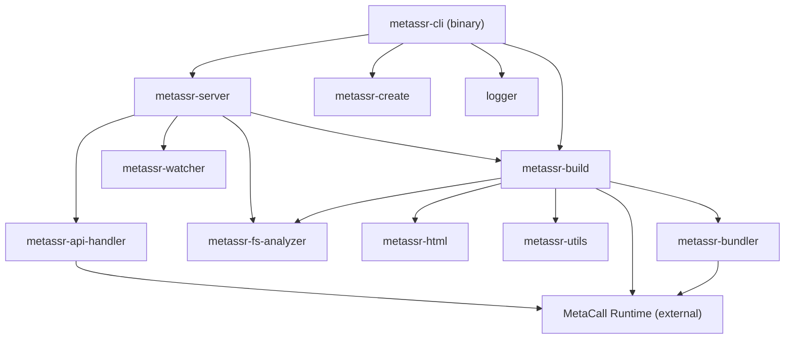
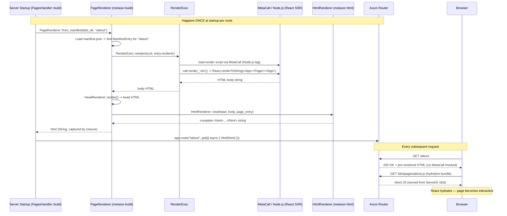
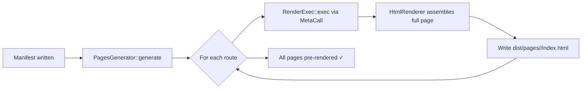
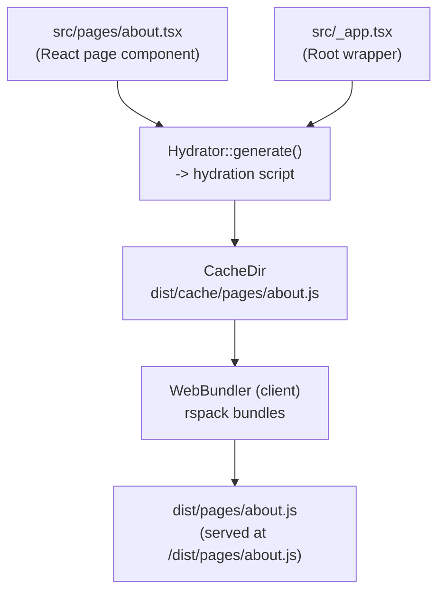
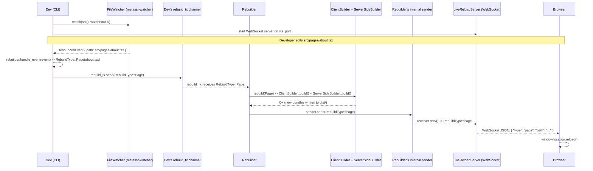
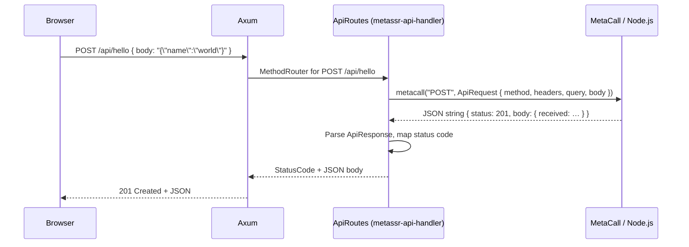
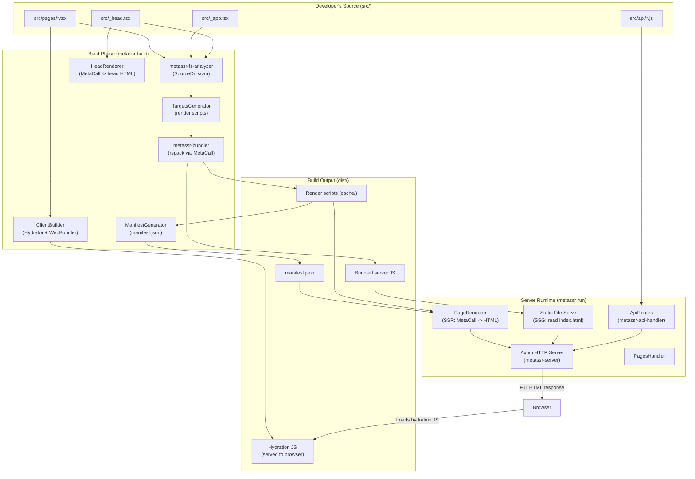

# MetaSSR — Framework Architecture

> This document is aimed at contributors and developers who want to understand how MetaSSR works internally.  
> It explains the high-level design, each crate's responsibility, and the flow of data through the system.

---

## Table of Contents

1. [Overview](#overview)
2. [Repository Layout](#repository-layout)
3. [Crate Dependency Graph](#crate-dependency-graph)
4. [Crate Responsibilities](#crate-responsibilities)
5. [Build Pipeline](#build-pipeline)
6. [SSR Request Lifecycle](#ssr-request-lifecycle)
7. [SSG (Static Site Generation) Pipeline](#ssg-static-site-generation-pipeline)
8. [Client Hydration Pipeline](#client-hydration-pipeline)
9. [Dev Mode & Hot Reload](#dev-mode--hot-reload)
10. [Polyglot API Routes](#polyglot-api-routes)
11. [MetaCall Integration Points](#metacall-integration-points)
12. [Key Data Structures](#key-data-structures)

---

## Overview

MetaSSR is a **Server-Side Rendering (SSR) framework for React.js** written in **Rust**. It exposes a developer experience similar to Next.js (file-based routing, `_app`, `_head` conventions) while achieving far higher throughput by:

- Using **Axum** (a Rust async HTTP framework) as the web server.
- Using **MetaCall** (a polyglot runtime) to execute **Node.js / JavaScript** from within the Rust process — for React rendering and bundling.
- Using **rspack** (a fast Rust-native JavaScript bundler exposed via a Node.js script) to compile JSX/TSX source files.

```
┌──────────────┐        ┌──────────────────────────────────────────────────────────┐
│  Browser /   │  HTTP  │                    MetaSSR Process                        │
│  HTTP Client │◄──────►│  Axum Server  +  MetaCall Runtime (Node.js / React SSR)  │
└──────────────┘        └──────────────────────────────────────────────────────────┘
```

---

## Repository Layout

```
metassr/
├── metassr-cli/            # CLI binary (clap-based, entry point)
├── crates/
│   ├── logger/             # Custom tracing/logging layer
│   ├── metassr-api-handler/# Polyglot API route handler (src/api/*.js)
│   ├── metassr-build/      # Build engine (SSR builder + Client builder)
│   │   └── src/
│   │       ├── server/     # ServerSideBuilder, renderers, manifest
│   │       └── client/     # ClientBuilder, hydrator
│   ├── metassr-bundler/    # MetaCall ↔ rspack bridge (WebBundler)
│   ├── metassr-create/     # Project scaffolding from templates
│   ├── metassr-fs-analyzer/# src/ and dist/ directory scanners
│   ├── metassr-html/       # HTML template builder
│   ├── metassr-server/     # Axum HTTP server, router, rebuilder, live-reload
│   ├── metassr-utils/      # Cache dir, random ID gen, shared helpers
│   └── metassr-watcher/    # File system watcher (notify + tokio broadcast)
├── docs/
│   ├── getting-started/    # User-facing getting-started guides
│   └── dev/                # Developer / contributor documentation  ← you are here
├── assets/                 # Logo and other static assets
├── scripts/                # Helper shell scripts
└── tests/                  # Integration tests
```

---

## Crate Dependency Graph

The diagram below shows how the internal crates depend on each other. Arrows point from consumer to dependency.



---

## Crate Responsibilities

### `metassr-cli`

The **entry point** of the framework. Parses command-line arguments with [`clap`](https://docs.rs/clap) and dispatches to one of four workflows:

| CLI Command | Struct | Description |
|-------------|--------|-------------|
| `metassr create` | `Creator` | Scaffold a new project from a template |
| `metassr build` | `Builder` | Build the project (SSR or SSG) |
| `metassr run`   | `Runner` | Start the production HTTP server |
| `metassr dev`   | `Dev`    | Start dev server with file watching & hot reload |

---

### `metassr-build`

The **build engine**. Contains two distinct builders:

| Builder | Source | Description |
|---------|--------|-------------|
| `ServerSideBuilder` | `crates/metassr-build/src/server/` | Renders React pages server-side; optionally pre-generates HTML (SSG) |
| `ClientBuilder` | `crates/metassr-build/src/client/` | Generates and bundles client-side hydration scripts |

Both builders implement the `Build` trait defined in `crates/metassr-build/src/traits.rs`.

---

### `metassr-bundler`

A **bridge between Rust and rspack** via MetaCall.

- Embeds a `bundle.js` Node.js script at compile time (`include_str!`).
- On first call, loads `bundle.js` into the MetaCall Node.js runtime.
- Calls the exported `web_bundling(targets, dist_path)` JavaScript function.
- Uses a `Condvar`-based wait mechanism to block until the async bundling job completes.

---

### `metassr-server`

The **Axum HTTP server**. Key types:

| Type | File | Description |
|------|------|-------------|
| `Server` | `src/lib.rs` | Main server struct; configures Axum router and starts listening |
| `PagesHandler` | `src/handler.rs` | Registers an Axum route for every built page |
| `Rebuilder` | `src/rebuilder.rs` | Reacts to file-change events and triggers incremental builds |
| `LiveReloadServer` | `src/live_reload.rs` | WebSocket server; pushes reload signals to the browser |
| `TracingLayer` | `src/layers/tracing.rs` | HTTP request tracing middleware |

Supports two running modes:
- **`ServerMode::Development`** — injects live-reload script, enables file watching.
- **`ServerMode::Production`** — no watchers, no live-reload overhead.

Supports two rendering modes per route:
- **`RunningType::ServerSideRendering`** — HTML is rendered on every request via MetaCall.
- **`RunningType::StaticSiteGeneration`** — pre-built `index.html` files are served directly.

---

### `metassr-fs-analyzer`

Scans project directories and returns structured data.

| Analyzer | Module | Output |
|----------|--------|--------|
| `SourceDir` | `src/src_dir.rs` | Page entries (`HashMap<route, PathBuf>`) + special entries (`_app`, `_head`) |
| `DistDir`   | `src/dist_dir.rs` | Bundled JS/CSS per page + static assets |

Both implement the `DirectoryAnalyzer` trait.

---

### `metassr-html`

Assembles a complete **HTML document string** from component parts:

- `HtmlTemplate` — the base `<!DOCTYPE html>…` skeleton.
- `HtmlProps` — carries `lang`, `head` HTML, `body` HTML, script paths, style paths.
- `HtmlBuilder::generate()` — performs string substitution to produce the final `HtmlOutput`.

---

### `metassr-watcher`

Wraps the [`notify`](https://docs.rs/notify) crate with a **tokio broadcast channel** so multiple async consumers (the rebuilder, the live-reload server) can independently react to file-system events.

---

### `metassr-utils`

Shared utility helpers:

| Utility | File | Description |
|---------|------|-------------|
| `CacheDir` | `src/cache_dir.rs` | A temporary build cache directory; stores generated intermediate files |
| `Rand` | `src/rand.rs` | Generates random `i64` IDs used to create unique render function names |
| `CheckerState` | `src/checker.rs` | A simple `bool`-like wrapper used for one-time initialisation guards |

---

### `metassr-api-handler`

Enables **polyglot API routes**: JavaScript files placed in `src/api/` are automatically mounted as HTTP endpoints.

- `scan_api_dir()` discovers `.js` files and maps filenames -> routes.
- For each file, it loads the script via MetaCall and registers Axum handlers for each exported HTTP method (`GET`, `POST`, `PUT`, `DELETE`, …).

---

### `metassr-create`

Project scaffolding helper. Prompts the user for project name, version, description, and template choice, then writes the template files to disk.

---

### `logger`

A custom [`tracing-subscriber`](https://docs.rs/tracing-subscriber) layer that writes structured log output both to the console and optionally to a log file.

---

## Build Pipeline

This is the most complex part of the framework. The diagram below shows the full sequence for `metassr build --type ssr`.

```mermaid
sequenceDiagram
    participant CLI as metassr-cli (Builder)
    participant SB as ServerSideBuilder
    participant FSA as SourceDir (metassr-fs-analyzer)
    participant TG as TargetsGenerator
    participant Cache as CacheDir (metassr-utils)
    participant Bundler as WebBundler (metassr-bundler)
    participant MC as MetaCall / Node.js (rspack)
    participant DD as DistDir (metassr-fs-analyzer)
    participant MG as ManifestGenerator
    participant HR as HeadRenderer
    participant CB as ClientBuilder

    CLI->>SB: build()
    SB->>FSA: SourceDir::analyze()
    FSA-->>SB: { pages, _app, _head }

    SB->>TG: TargetsGenerator::new(app, pages, cache).generate()
    TG->>Cache: Write render scripts for each page
    TG-->>SB: targets (route -> render script path)

    SB->>Bundler: WebBundler::new(bundling_targets, dist_path).exec()
    Bundler->>MC: load bundle.js; call web_bundling(targets, dist)
    MC-->>Bundler: bundled JS written to dist/
    Bundler-->>SB: Ok(())

    SB->>DD: DistDir::analyze()
    DD-->>SB: { pages: { route -> PageEntry(js, css) } }

    SB->>MG: ManifestGenerator::new(targets, cache, dist).generate(&head)
    MG-->>SB: Manifest { global: { head, cache }, pages: { route -> ManifestEntry } }
    SB->>SB: manifest.write(dist_path)

    SB->>HR: HeadRenderer::new(&head, cache).render(true)
    HR->>MC: MetaCall renders _head component -> HTML string
    HR-->>SB: head HTML

    Note over CLI,CB: Also runs ClientBuilder (for hydration scripts)
    CLI->>CB: ClientBuilder::build()
    CB->>FSA: SourceDir::analyze()
    CB->>Cache: Hydrator::generate() per page -> write hydration scripts
    CB->>Bundler: WebBundler::exec() -> bundle hydration scripts
    Bundler->>MC: rspack bundles hydration JS
    MC-->>CB: hydrated bundles in dist/
```

### What each step produces

| Step | Output artifact |
|------|-----------------|
| `SourceDir::analyze()` | In-memory page map + special entry paths |
| `TargetsGenerator` | Generated render scripts in `dist/cache/` |
| `WebBundler` (server) | Bundled server render scripts in `dist/` |
| `ManifestGenerator` | `dist/manifest.json` (route -> bundle mapping) |
| `HeadRenderer` | Rendered `<head>` HTML fragment in cache |
| `WebBundler` (client) | Bundled hydration JS in `dist/` (served to browser) |

---

## SSR Request Lifecycle

> **Important implementation note:** Despite the mode being called "Server-Side Rendering", the current implementation renders each page's HTML **once at server startup** (inside `PagesHandler::build()`), captures the resulting string in an Axum handler closure, and returns the same pre-rendered HTML on every subsequent request. MetaCall / React SSR is therefore **not invoked per-request** — it runs once per page at startup time. Dynamic per-request rendering is a future goal.



---

## SSG (Static Site Generation) Pipeline

When `metassr build --type ssg` is used, the build pipeline performs an additional **pre-rendering** step after the manifest is written:



At **runtime** (`metassr run --serve`), the server simply reads the pre-built `index.html` files — no MetaCall invocation happens per request:

```
Browser -> GET /about -> PagesHandler reads dist/pages/about/index.html -> 200 OK
```

This makes SSG responses effectively free (disk I/O only).

---

## Client Hydration Pipeline

After the server sends the initial HTML, React must **hydrate** the static markup on the client for interactivity.



The hydration script:
1. Imports the same `_app.tsx` and page component used on the server.
2. Calls `ReactDOM.hydrateRoot(document.getElementById('root'), <App><Page/></App>)`.
3. This attaches React's event system to the already-rendered DOM, making the page interactive without a full re-render.

---

## Dev Mode & Hot Reload

`metassr dev` starts a development server with **hot reload** support. It uses **two separate broadcast channels** internally.



> **Current limitation:** Because Axum handler closures capture the pre-rendered HTML **by value at server startup**, a hot rebuild updates the bundled JS/CSS files in `dist/` (reflected after browser reload) but the **HTML body is not refreshed** until the dev server is restarted. Granular `Layout`, `Component`, `Style`, and `Static` rebuild types are classified but not yet implemented — they log a warning and skip the rebuild.

Key components in dev mode:

| Component | Role |
|-----------|------|
| `FileWatcher` | Wraps `notify` with 100 ms debounce; emits events over a tokio broadcast channel |
| `Rebuilder` | Classifies events into `RebuildType`; currently **only `Page` triggers an actual rebuild** — `Layout`, `Component`, `Style`, `Static` log a warning `"not yet implemented"` |
| `LiveReloadServer` | WebSocket server; sends typed JSON messages e.g. `{ "type": "page", "path": "..." }` to connected tabs |
| `inject_live_reload_script` middleware | Intercepts HTML responses and injects `<script src="/livereload/script.js"></script>` before `</body>` |
| Injected `live-reload.js` | Served at `/livereload/script.js`; connects to the WebSocket and calls `window.location.reload()` on any message |

---

## Polyglot API Routes

MetaSSR supports defining backend API endpoints in JavaScript, loaded and executed via MetaCall.

### File Convention

```
src/
└── api/
    ├── hello.js      -> mounted at /api/hello
    └── users/
        └── index.js  -> mounted at /api/users
```

### Handler Example

```javascript
// src/api/hello.js
function GET(req) {
    return JSON.stringify({ status: 200, body: { message: "Hello!" } });
}
function POST(req) {
    const data = JSON.parse(req.body || "{}");
    return JSON.stringify({ status: 201, body: { received: data } });
}
module.exports = { GET, POST };
```

### Request Flow



---

## MetaCall Integration Points

MetaCall is the polyglot runtime that lets Rust call Node.js functions. MetaSSR uses it in three places:

| Location | Crate | What is called |
|----------|-------|---------------|
| JavaScript bundling | `metassr-bundler` | `web_bundling(targets, dist_path)` in `bundle.js` — runs rspack |
| React SSR rendering | `metassr-build` (`render_exec.rs`) | `render_<id>()` — a generated function that calls `React.renderToString()`. Called **once per page at server startup**, not per-request. |
| API route handling | `metassr-api-handler` | `GET(req)` / `POST(req)` / … exported from `src/api/*.js` |

All MetaCall calls use the **Node.js loader tag** (`load::Tag::NodeJS`) and the shared global MetaCall context initialised once at startup.

> **Note:** The `IS_BUNDLING_SCRIPT_LOADED` lazy static in `metassr-bundler` prevents the `bundle.js` script from being loaded more than once into the runtime, since MetaCall does not support re-loading the same script.

---

## Key Data Structures

### `Manifest` (`dist/manifest.json`)

Written after a build; read by the server at runtime (SSR mode) to find the render script and asset paths for each route.

```json
{
  "global": {
    "head": "/absolute/path/to/src/_head.tsx",
    "cache": "dist/cache"
  },
  "routes": {
    "#root": {
      "id": 1234567890,
      "renderer": "/absolute/path/to/dist/cache/pages/index.js",
      "page_entry": {
        "path": "dist/pages/index/",
        "scripts": ["dist/pages/index.js"],
        "styles":  ["dist/pages/index.css"]
      }
    },
    "about": { "..." : "..." }
  }
}
```

> **Notes:**
> - `global.head` is the **absolute path to `src/_head.[tsx|jsx|js|ts]`** (the source file), not a cache directory.
> - The top-level page map key is `routes` (matching the private `Manifest.routes` field serialized by serde).
> - `renderer` holds the **absolute canonicalized path** to the generated render script in the cache.

### `SourceDirContainer`

Returned by `SourceDir::analyze()`:
- `pages: HashMap<String, PathBuf>` — maps route name -> source file path
- `specials: (Option<App>, Option<Head>)` — paths to `_app.[tsx|jsx|js|ts]` and `_head.[tsx|jsx|js|ts]`

### `PageEntry` (from `DistDir`)

Returned per route by `DistDir::analyze()`:
- `path: PathBuf` — directory in `dist/pages/<route>/`
- `scripts: Vec<PathBuf>` — bundled JS files
- `styles: Vec<PathBuf>` — bundled CSS files

### `RebuildType`

Enum used by `Rebuilder` and `LiveReloadServer` to coordinate what needs to be rebuilt:

```rust
pub enum RebuildType {
    Page(PathBuf), // A specific page was changed
    Layout,        // _app layout changed
    Component,     // A shared component changed
    Style,         // Only styles changed
    Static,        // A file in static/ changed
}
```

---

## Summary Diagram

The following diagram shows the complete lifecycle from source code to a served response.


