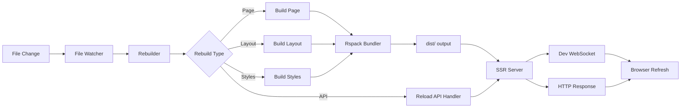

# Dev Mode Rebuild Flow

```mermaid
flowchart LR
  Change["File Change"] --> Watcher["File Watcher"]
  Watcher --> Rebuilder["Rebuilder"]
  Rebuilder --> Type{"Rebuild Type"}

  Type -->|"Page"| BuildPage["Build Page"]
  Type -->|"Layout"| BuildLayout["Build Layout"]
  Type -->|"Styles"| BuildStyles["Build Styles"]
  Type -->|"API"| ReloadAPI["Reload API Handler"]

  BuildPage --> Bundler["Rspack Bundler"]
  BuildLayout --> Bundler
  BuildStyles --> Bundler
  Bundler --> Dist["dist/ output"]

  Dist --> Server["SSR Server"]
  ReloadAPI --> Server

  Server --> WS["Dev WebSocket"]
  WS --> Browser["Browser Refresh"]
  Server --> HTTP["HTTP Response"]
  HTTP --> Browser
```
