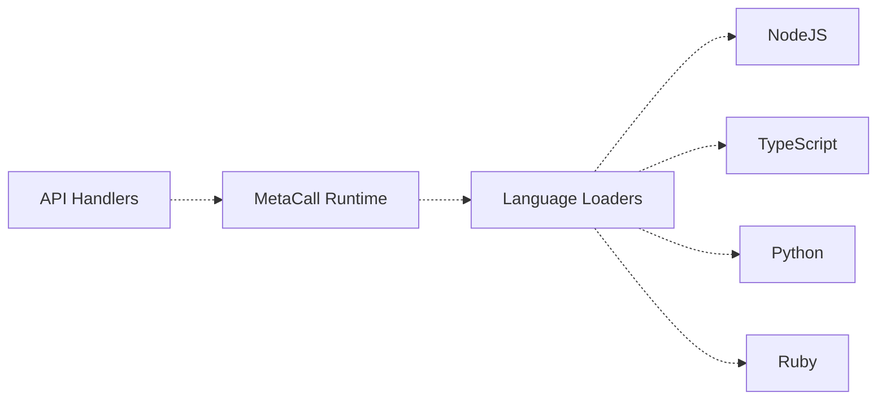

# MetaSSR Architecture Overview

## Build & Dev Tooling

```mermaid
flowchart TB
  CLI["metassr CLI"]
  Mode{"Mode"}
  Watcher["File Watcher"]
  Rebuilder["Rebuilder"]
  Builder["Builder"]
  Bundler["Rspack Bundler"]
  Dist["dist/ output"]
  Server["SSR Server"]

  CLI --> Mode
  Mode -->|Dev| Watcher
  Mode -->|Prod| Builder
  Watcher --> Rebuilder
  Rebuilder --> Bundler
  Builder --> Bundler
  Bundler --> Dist
  Dist --> Server```

## Runtime (Relationships)

```mermaid
flowchart TB
  Server["SSR Server"]
  Router["Router"]
  Pages["Pages + Components"]
  API["API Handlers"]
  Static["Static Assets"]

  Server -.-> Router
  Router -.-> Pages
  Router -.-> API
  Router -.-> Static

  API["API Handlers"]
  MetaCall["MetaCall Runtime"]
  Loaders["Language Loaders"]
  NodeJS["NodeJS"]
  TS["TypeScript"]
  Py["Python"]
  Rb["Ruby"]

  API -.-> MetaCall
  MetaCall -.-> Loaders
  Loaders -.-> NodeJS
  Loaders -.-> TS
  Loaders -.-> Py
  Loaders -.-> Rb


  Note["Dashed means structural/uses, not in sequence"]:::note
  Note -.-> Router

  classDef note fill:#f9f9f9,stroke:#888,color:#333;
```

## Polyglot Runtime


