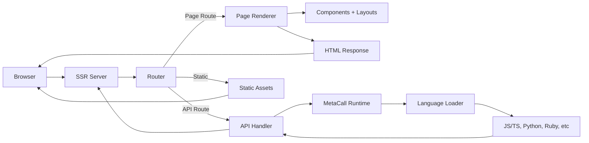

# Runtime Request Flow

```mermaid
flowchart LR
  Browser["Browser"] --> Server["SSR Server"]
  Server --> Router["Router"]

  Router -->|"Page Route"| Renderer["Page Renderer"]
  Renderer --> Components["Components + Layouts"]
  Renderer --> HTML["HTML Response"]
  HTML --> Browser

  Router -->|"API Route"| API["API Handler"]
  API --> MetaCall["MetaCall Runtime"]
  MetaCall --> Loader["Language Loader"]
  Loader --> Lang["JS/TS, Python, Ruby, etc"]
  Lang --> API
  API --> Server

  Router -->|"Static"| Static["Static Assets"]
  Static --> Browser
```
